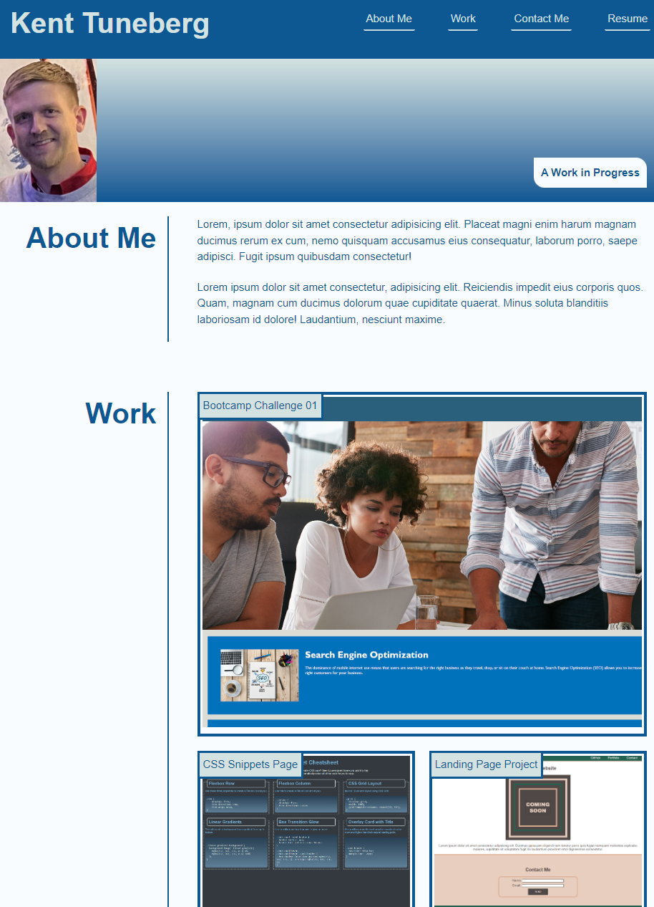

# challenge-02-advanced-css-portfolio

## Description

This is a project for UW bootcamp in which we construct a portfolio page that can be added to and edited as we learn. It contains an "About Me" section, a section for our completed work and projects, a section for our contact info, and a place to put our resume.

## Installation

N/A

## Usage

This page is responsive and will change orientation as screen size changes. The screenshot of each project is a link to that project. 

Link to deployed application: 

## Credits

Color palette generated on https://www.khroma.co/generator

## License

N/A